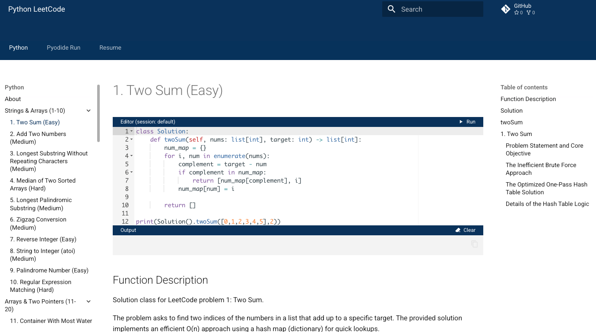

# Python LeetCode

Here you will find my Python solutions for LeetCode problems, typically developed and tested within the Visual Studio Code integrated development environment.

Static site generation is done with Python Make Docs. Run your code with Pyodide.

Browse source code here (sidebar to the left) or visit [GitHub](https://github.com/lukeclarksf/leetcode).

Luke Clark

Send me an email at [lukeclarksf@gmail.com](mailto:lukeclarksf@gmail.com). See my [Resume](https://lukeclarksf.com).

