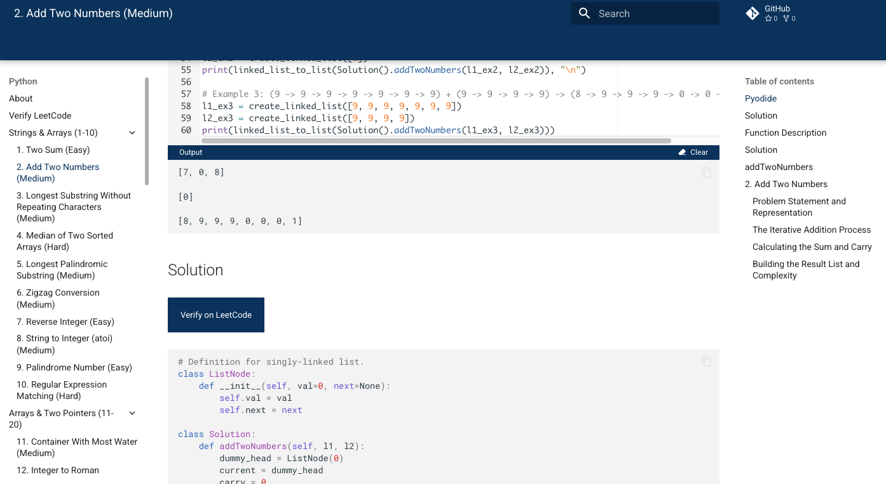
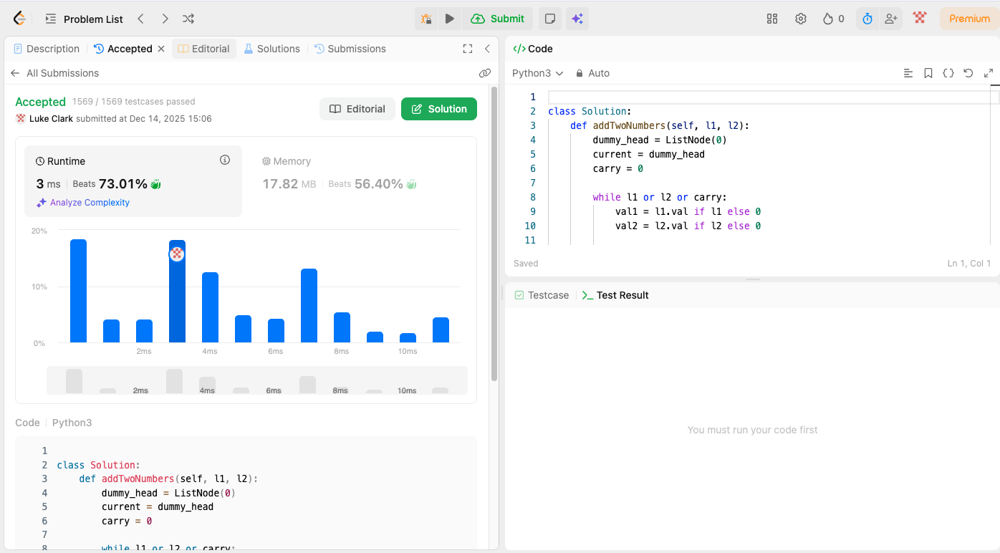

# Python

You will find my Python solutions for LeetCode problems, typically developed and tested within the Visual Studio Code integrated development environment. LeetCode includes Data Structures and Algorithms to practice. Solve LeetCode problems very efficiently.

<iframe class="intro-video" width="704" height="396" src="https://www.youtube.com/embed/bKbqjK6mM5o?si=QXTlZpOsunCKfQpl" title="YouTube video player" frameborder="0" allow="accelerometer; autoplay; clipboard-write; encrypted-media; gyroscope; picture-in-picture; web-share" referrerpolicy="strict-origin-when-cross-origin" allowfullscreen></iframe>

Browse source code in the left sidebar or visit <a href="https://github.com/lukeclarksf/leetcode" target="__blank">GitHub</a>. Run your code with Pyodide. Verify problems directly on <a href="https://leetcode.com/problems/add-two-numbers/" target="__blank">LeetCode</a>. Static site generation is done with Make Docs.

Luke Clark

Send me an email at <a href="mailto:lukeclarksf@gmail.com">lukeclarksf@gmail.com</a>. See my <a href="https://lukeclarksf.com" target="__blank">Resume</a>.

<h2>Learn Data Structures and Algorithms</h2>

Read function source code and documentation.

<h2>Submit to LeetCode</h2>

Submit problems easily directly to LeetCode.

